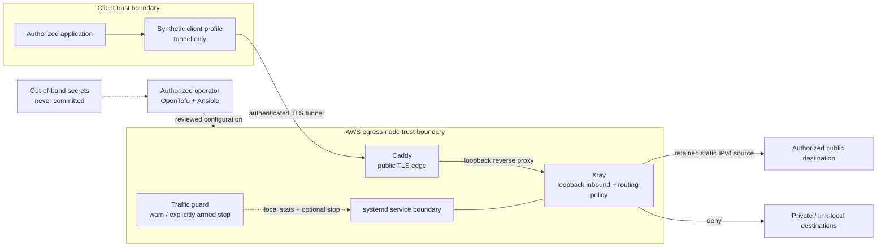

# Secure Egress Blueprint

**A security-first reference architecture for deterministic, fail-closed egress
on AWS using OpenTofu, Ansible, Caddy, and Xray.**

[](https://github.com/ChanTso/secure-egress-blueprint/actions/workflows/ci.yml)
[](pyproject.toml)
[](infra/tofu/versions.tf)
[](LICENSE)

This project demonstrates how to make one controlled AWS egress path
predictable and reviewable: infrastructure creation is locked off by default,
the public TLS edge can reach Xray only over loopback, private and link-local
destinations are denied, client examples have no direct fallback, and service
changes are validated before activation.

> [!IMPORTANT]
> This is a default-disabled reference implementation—not a production
> runbook. It is single-node, not highly available, and does not provide
> anonymity. Its traffic controls are safeguards, not a billing hard limit.

## The problem

Applications sometimes need an allowlisted source address without turning a
general-purpose host into an unreviewed proxy. A naive tunnel solves the source
address problem but introduces harder questions:

- What happens when the tunnel, certificate, or configuration fails?
- Can the client silently bypass the controlled path?
- Can the proxy reach internal, metadata, or link-local destinations?
- Where do credentials live, and can generated artifacts enter Git?
- Can a partial deployment leave an unsafe or broken service active?
- How is unexpected traffic detected without pretending an alarm is a cost cap?

Secure Egress Blueprint turns those questions into explicit configuration,
validation, and failure behavior.

## Key capabilities

- **Deterministic egress:** an OpenTofu module models a single AWS Lightsail
  IPv4-only node with a retained static IPv4 address.
- **Default-closed infrastructure:** `deployment_enabled = false` produces no
  managed node; opening the interlock requires a separate explicit
  acknowledgement.
- **Constrained desired-state ingress:** TLS sources must be non-empty and
  valid, all world-open IPv4 CIDRs are rejected, and SSH is disabled by default
  with a separate allowlist.
- **Layered proxy boundary:** Caddy terminates public TLS and reverse-proxies
  only to a loopback Xray inbound; unknown paths are rejected.
- **Fail-closed client examples:** synthetic client configuration contains the
  tunnel outbound and no direct/freedom fallback.
- **Destination policy:** Xray defaults to a blackhole route and permits only
  tunnel traffic that clears the protected-address policy after DNS-aware
  evaluation and a second final-IP check in the freedom outbound.
- **Transactional configuration:** Ansible stages and validates candidate
  configuration before activating it, with a health-checked recovery path.
- **Host hardening:** dedicated service identities, restrictive file modes,
  normalized path boundaries, and systemd sandboxing reduce the impact of a
  service compromise. The root traffic guard drops Xray stats-query subprocesses
  to the fixed `xray` identity.
- **Traffic safeguards:** a Lightsail-native observational NetworkOut alarm and
  pure local decision logic support warning and a separately armed persistent
  shutdown of the managed data plane. Decision-only
  mode never mutates services; enforcement mode treats invalid or unavailable
  metrics as a fail-closed condition.
- **Local evidence:** unit, template, formatting, lint, privacy, secret, Git,
  and package checks are exposed through focused Make targets and CI.

## Architecture and data flow



The public listener, loopback handoff, host privilege boundary, outbound
Internet, operator workstation, and secret store are separate trust
boundaries. See [Architecture](docs/architecture.md) and
[Threat model](docs/threat-model.md).

## Security properties and evidence

| Property | Mechanism | Repository evidence |
| --- | --- | --- |
| No infrastructure by default | Conditional module count plus blocking module-input validation | `infra/tofu/main.tf`, variable tests |
| Final modeled ingress excludes world-open CIDRs | Prefix-length validation; SSH disabled separately | `infra/tofu/variables.tf`, contract tests |
| No accidental direct client route | Synthetic client omits `freedom` fallback | client template and structural tests |
| Public edge cannot address a remote Xray listener | Xray binds loopback; Caddy proxies to loopback | templates, `config_checks.py`, render tests |
| Protected private and special-use destinations are denied | DNS-aware route blocklist plus a matching freedom final-IP rule | Xray template, structural and negative tests |
| Candidate configuration is checked before activation | stage, render, validate, then activate | Ansible tasks and failure-path tests |
| Failed activation has a verified closed fallback | a restored release must pass listener/health checks; otherwise managed units must be proven inactive and not boot-enabled before the active pointer is removed | Ansible rescue tasks and contract tests |
| Host mutation needs a second gate | Ansible independently requires a boolean and exact acknowledgement | role defaults, preflight assertions, contract tests |
| Budget shutdown is opt-in, fixed, and persistent | acknowledgement, `--enforce`, fixed Caddy/Xray/timer set, `disable --now` | `traffic_guard.py`, unit tests |
| Examples remain synthetic | privacy linter rejects unapproved identifiers and cloud mutation commands | `privacy_lint.py`, CI |

“Fail-closed” has a specific meaning here: supplied client examples do not
route directly when the protected path fails; invalid server configuration is
not intentionally activated; unknown HTTP paths are rejected; and the routing
policy denies protected destination classes. It does **not** mean that every
possible client, DNS resolver, operating system, or operator modification is
controlled by this repository.

## Safe quick start

The following path exercises source and static checks only. It does not apply
infrastructure, contact AWS APIs, configure DNS, or change a host.

```console
git clone https://github.com/ChanTso/secure-egress-blueprint.git
cd secure-egress-blueprint
python3 -m venv .venv
. .venv/bin/activate
python3 -m pip install --editable '.[dev]'
make lint
make test
make privacy
```

With OpenTofu, Ansible tooling, ShellCheck, and Gitleaks installed, run the
complete local quality gate:

```console
make verify
```

`make help` lists each non-deployment target. OpenTofu initialization disables
the backend and may download only the lockfile-pinned provider; the subsequent
validate phase clears AWS credential selectors and uses dead network proxies.
No deploy, apply, destroy, DNS, or host-configuration target is provided.

## Configuration model

Configuration is split by responsibility:

| Layer | Public inputs | Sensitive or local-only inputs |
| --- | --- | --- |
| OpenTofu | region/AZ shape, synthetic name prefix, ingress policy, alarm policy | deployment acknowledgement, existing key name, preconfigured regional Lightsail contact methods |
| Ansible | package/service policy, public hostname, listener relationship | tunnel identity, private inventory, host access material |
| Caddy/Xray | templates and structural policy | rendered credentials and host-specific values |
| Client | synthetic schema and fail-closed routing shape | generated per-user profile |
| Traffic guard | thresholds, decision mode, validated Xray service identifier, fixed Xray query identity and managed shutdown unit set | local state and explicit stop acknowledgement |

The committed `terraform.tfvars.example` is synthetic and keeps
`deployment_enabled = false`. Examples use `egress.example.com`,
RFC 5737 addresses such as `198.51.100.0/24`, and visibly synthetic
identifiers.

## Secret handling

Secrets are configuration inputs, not source files:

- do not place tunnel identities, private keys, credentials, inventory, state,
  plans, generated client profiles, or QR codes in Git;
- keep secret material in an operator-selected secret system and inject it only
  for an authorized deployment;
- render server secrets into root-controlled staging paths before atomic
  activation;
- generate client artifacts outside the repository and distribute them through
  an independently secured channel; and
- treat logs, CI artifacts, shell history, backups, and state as potential
  disclosure paths.

`.gitignore`, privacy lint, Gitleaks, and push protection are complementary
controls. None is a substitute for rotating a credential after exposure.

The committed Caddy template uses its synthetic internal issuer only. Public
certificate issuance, DNS challenges, and certificate injection are deliberately
left to an independently reviewed adaptation; the narrow firewall model is not
presented as compatible with default public ACME challenges.

## Repository layout

```text
.
├── infra/tofu/                 # Default-disabled AWS module and validation
├── ansible/                    # Transactional role, service units, and configuration templates
├── src/secure_egress/          # Privacy/config checks and traffic guard
├── scripts/                    # Local-only validation helpers
├── tests/                      # Unit, policy, and template-render tests
├── docs/                       # Architecture, security, threats, and adoption
└── .github/                    # CI, dependency, and contribution policy
```

## Testing and quality gates

`make verify` composes:

- Ruff lint, formatting, and Python byte-compilation;
- pytest unit tests, coverage threshold, and template-render tests;
- recursive OpenTofu formatting, read-only-lock initialization, and a
  credential-free/dead-network validate phase;
- YAML lint, Ansible syntax checking, and ansible-lint;
- ShellCheck;
- the repository synthetic-data/privacy policy;
- Gitleaks over Git history; and
- Python source-distribution and wheel builds.

GitHub Actions repeats these checks in the required `Test` check. GitHub-managed
CodeQL default setup provides independent analysis. Passing checks are evidence
about the committed implementation; they are not certification of an
operator's AWS account, client, DNS, or deployed host.

## Limitations and non-goals

- **Single node:** maintenance or failure interrupts egress; this is not HA.
- **Not anonymity:** AWS, the destination, DNS providers, and capable network
  observers may correlate traffic. A stable address is deliberately
  linkable.
- **Not a billing cap:** the five-minute Lightsail alarm and local counters can be delayed,
  reset, incomplete, or unavailable. Provider charges remain authoritative.
- **No universal leak prevention:** only supplied client examples are checked;
  other applications and operating-system routes require separate review.
- **No production runbook:** account bootstrap, DNS changes, certificate
  operations, credential issuance, and live deployment are intentionally
  omitted.
- **No zero-downtime guarantee:** coherent releases are switched atomically,
  but service restarts and recovery can interrupt egress.
- **Lightsail provisioning window:** a new base-OS instance starts with
  world-open SSH and HTTP rules before the separate desired-state firewall
  resource replaces them. This blueprint cannot make those API operations
  atomic. An adopter that cannot tolerate that transient exposure should use a
  compute primitive with creation-time network policy. See the
  [AWS default firewall documentation](https://docs.aws.amazon.com/lightsail/latest/userguide/understanding-firewall-and-port-mappings-in-amazon-lightsail.html).
- **No managed identity plane:** user lifecycle, device attestation, and
  enterprise access control are outside this repository.
- **Linux-specific reference:** the transactional symlink switch and systemd
  hardening are not claimed to be portable across distributions or init
  systems.
- **No guarantee against a privileged operator or compromised host:** either
  can alter policy, observe traffic, or disable controls.

## Responsible and authorized use

Use this project only on accounts, systems, and networks you own or are
explicitly authorized to administer. Review cloud cost, acceptable-use,
privacy, export, monitoring, and destination policies before adapting the
design. Do not use it to evade access controls or conceal abuse.

## Documentation

- [Architecture](docs/architecture.md) — components, flows, and invariants
- [Threat model](docs/threat-model.md) — assets, adversaries, threats, controls
- [Security model](docs/security-model.md) — guarantees, assumptions, secrets
- [Deployment model](docs/deployment.md) — non-operational adoption checklist
- [Failure modes](docs/failure-modes.md) — expected failure and recovery behavior
- [Architecture decisions](docs/decisions.md) — accepted trade-offs and consequences
- [Contributing](CONTRIBUTING.md)
- [Security policy](SECURITY.md)
- [Third-party notices](THIRD_PARTY_NOTICES.md)
- [Apache License 2.0](LICENSE)

## Contributing, security, and license

Read [CONTRIBUTING.md](CONTRIBUTING.md) before opening a pull request. Report
vulnerabilities privately as described in [SECURITY.md](SECURITY.md).

The original content of this repository is licensed under the
[Apache License 2.0](LICENSE). Referenced upstream software keeps its own
license; see [THIRD_PARTY_NOTICES.md](THIRD_PARTY_NOTICES.md).
