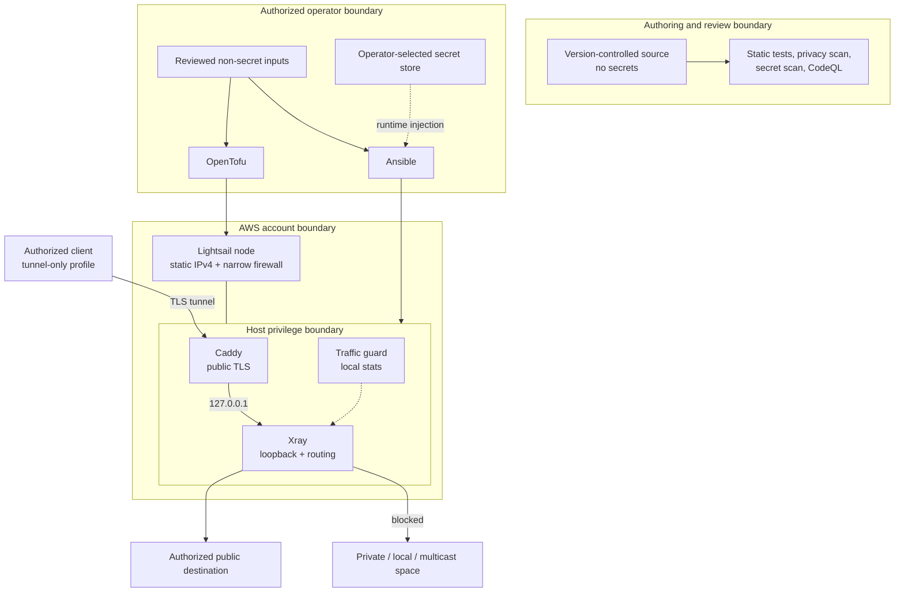
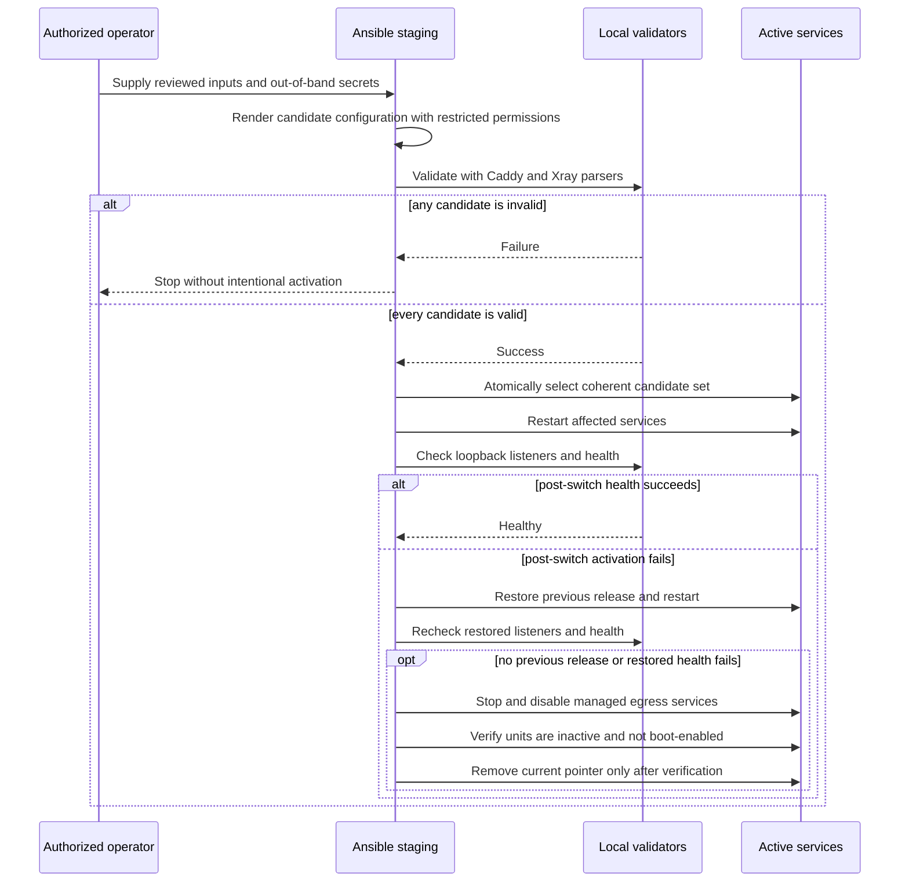

# Architecture

## Purpose

Secure Egress Blueprint is a reference design for one controlled public egress
address. Its goal is deterministic policy and failure behavior, not maximum
availability or anonymity.

The design separates five concerns:

1. OpenTofu models a default-disabled IPv4-only AWS node, static IPv4 address,
   ingress rules, deletion protection, and optional
   Lightsail-native observational alarm.
2. Ansible stages host configuration, validates candidates, and activates only
   a coherent configuration set.
3. Caddy owns the public TLS boundary and forwards the selected path only to a
   loopback Xray listener.
4. Xray authenticates the tunnel and applies destination policy both during
   DNS-aware routing and immediately before the public connection.
5. Python utilities verify rendered configuration, enforce synthetic examples,
   and make traffic-budget decisions.

## Component view

## Data flow

1. An application chooses the synthetic tunnel outbound. The supplied client
   structure has no direct fallback.
2. The connection reaches the retained static IPv4 address through a restricted
   TLS ingress rule.
3. Caddy terminates TLS. A designated path is proxied to Xray over loopback;
   unmatched paths receive a not-found response.
4. Xray authenticates the tunnel, resolves destinations as required for policy
   evaluation, and rejects protected address classes. The freedom outbound
   repeats the same protected-address check on the final resolved IP.
5. Allowed traffic exits through the IPv4-only node's public network interface.
   The destination observes the attached static IPv4 source while the address
   remains allocated.
6. Local Xray counters can feed the traffic guard. Its root process drops the
   Xray stats-query subprocess to the fixed `xray` identity. The default behavior
   reports a decision. With both the configuration acknowledgement and
   enforcement flag, a threshold or guard error persistently stops and disables
   the fixed Caddy, Xray, and timer unit set.

## Control flow

The transaction boundary is the set of related Caddy, Xray, service, and guard
configuration. Validation occurs before the current pointer is replaced. A
pre-switch failure leaves the active pointer and services untouched. After a
switch, recovery restores the prior controlled release and subjects it to the
same listener and health checks; if no prior release exists or restored health
fails, the role stops and disables the managed
services, verifies that they are inactive and not boot-enabled, and only then
removes the current pointer. If that state cannot be proved, the deployment
remains failed and reports an uncertain closure instead of claiming success.
Host-level loss still requires operator recovery.

## Trust boundaries

| Boundary | Trusted for | Not trusted for |
| --- | --- | --- |
| Source and CI | Reviewable templates and repeatable static evidence | Holding deployment secrets or proving live-state safety |
| Operator workstation | Selecting authorized inputs and handling secrets | Being intrinsically uncompromised |
| AWS account/API | Hosting modeled resources and enforcing configured firewall rules | Confidentiality from the cloud provider |
| Public Caddy listener | TLS termination and narrow path routing | General application hosting or authorization beyond configured tunnel behavior |
| Loopback handoff | Keeping Xray off a public socket | Protecting against host root or kernel compromise |
| Xray policy | Tunnel authentication and destination filtering | Anonymity or protection from endpoint traffic analysis |
| Client device | Honoring the supplied fail-closed profile | Preventing local malware or administrator changes |
| Public destination | Receiving allowed traffic | Privacy, correctness, or benevolence |

## Architectural invariants

- Infrastructure creation remains conditional on an explicit interlock.
- The node is IPv4-only so the retained static IPv4 covers modeled egress.
- The example TLS allowlist is non-world-open; SSH is independently disabled by
  default.
- Xray does not accept a public bind in the supplied server configuration.
- Caddy targets only a loopback Xray address.
- Supplied client configuration contains no direct/freedom outbound.
- Protected address classes are denied after DNS-aware routing evaluation and by
  the freedom outbound's final-IP rule.
- Secrets and generated client artifacts remain outside version control.
- A traffic-stop action accepts a validated Xray service identifier and can
  address only the fixed managed shutdown unit set; stats queries run as the
  fixed `xray` identity.
- Local validation does not inspect cloud state or mutate infrastructure.

Tests should fail when a change violates an invariant. A change that
intentionally revises an invariant must update the relevant test, this
document, and the threat model in one pull request.

## Availability and scaling

The reference node is a single failure domain. A stable source address and a
simple review surface are prioritized over failover. Adding a second node,
load balancing, health-based routing, or automatic replacement changes both
the externally observed source set and the trust model; those features are
deliberately not implied by this design.
