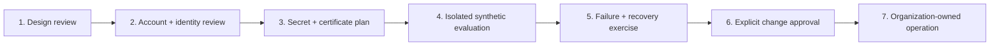

# Deployment model

## Why this is not a runbook

This repository intentionally does not contain a command sequence for applying
infrastructure, changing DNS, issuing certificates, configuring a live host, or
onboarding a real client. Those actions are environment-specific, can incur
cost, and cross authorization boundaries that a public reference cannot
verify.

The committed configuration remains non-deploying. After pinned tools and the
lockfile-selected provider are installed, validation needs no cloud
credentials, remote state, external DNS, or reachable server. Backend-disabled
initialization may fetch that provider from its public registry.

This document is a review framework for an organization considering an
authorized adaptation. It is not sufficient approval to deploy.

## Adoption gates

### 1. Design review

- Confirm that a single fixed IPv4 address is the actual requirement.
- Document authorized source networks and public destinations.
- Review [architecture](architecture.md), [threat model](threat-model.md), and
  [failure modes](failure-modes.md) against the intended environment.
- Decide whether the single-node availability limitation is acceptable.
- Identify client platforms and how direct-route leakage will be tested.

### 2. Account and identity review

- Use an organization-owned AWS account and a purpose-specific least-privilege
  role.
- Independently review provider permissions, state storage, region support,
  deletion protection, quota, and estimated cost.
- Decide whether the transient default Lightsail firewall exposure during
  provisioning is acceptable. If not, select a compute primitive that binds
  network policy atomically at creation; the later public-ports resource cannot
  remove this window.
- Keep administrative ingress disabled unless a reviewed access method
  requires it; if enabled, use a narrow independent allowlist.
- Confirm that only authorized maintainers and operators can change source,
  workflows, state, or secrets.

### 3. Secret and certificate plan

- Choose a managed secret system and define issuance, distribution, rotation,
  revocation, backup, and incident procedures.
- Keep AWS credentials, tunnel identities, private keys, inventory, plans,
  state, generated profiles, and QR codes outside Git and public CI.
- Establish authorized DNS and certificate control for an
  organization-owned hostname; `egress.example.com` is documentation only.
- Replace the committed internal-issuer template only in a separately reviewed
  adaptation. Default public ACME challenges are not modeled because the
  reference firewall intentionally does not expose unrestricted ports 80/443.
- Define log redaction and artifact-retention rules before any real value is
  rendered.

### 4. Isolated synthetic evaluation

- Start in a separate, non-production account and network under explicit
  authorization.
- Replace only documented inputs, preserving the deployment interlock until
  the change is independently reviewed.
- Run every local quality gate before any environment-specific process.
- Validate firewall exposure, loopback bindings, service identities, file
  modes, destination blocks, and absence of a client direct fallback.
- Use only owned test destinations; never probe third-party or private
  networks without authorization.

### 5. Failure and recovery exercise

Exercise at least:

- invalid Caddy and Xray candidates;
- loss of DNS or certificate renewal;
- package or service restart failure;
- host reboot and process crash;
- unavailable or reset traffic counters;
- traffic threshold warning and explicitly armed stop in a synthetic setting;
- credential revocation;
- static-address or node loss; and
- restoration from the documented last known configuration.

Record recovery time and decide whether the lack of automated failover meets
the service requirement.

### 6. Explicit change approval

The organization—not this repository—must approve:

- the exact account, region, availability zone, names, CIDRs, and cost;
- the state backend and locking/recovery procedure;
- DNS and certificate changes;
- credential creation and recipients;
- infrastructure creation and configuration execution;
- monitoring destinations and retention;
- the meaning and consequences of any automatic stop; and
- rollback or decommission actions.

### 7. Organization-owned operation

A production owner needs procedures for patching, dependency review,
certificate renewal, credential rotation, access review, alarm response,
incident handling, state backup, drift detection, recovery, and
decommissioning. None of those responsibilities transfers to the reference
repository.

## Configuration review checklist

| Area | Required review |
| --- | --- |
| Deployment interlock | remains false in committed files; authorization is separate from configuration |
| Region and zone | supported, approved, and costed |
| Static address | lifecycle, replacement behavior, allowlist consumers |
| TLS ingress | valid narrow CIDRs; never `0.0.0.0/0` |
| SSH | disabled or separately justified and restricted |
| TLS identity | authorized hostname, certificate control, renewal failure |
| Tunnel identity | unique issuance, secure distribution, revocation |
| Destination policy | protected ranges plus organization-specific denies |
| Traffic policy | measurement source, lag, reset behavior, notification owner |
| Auto-stop | consequence understood; separately acknowledged; synthetic exercise completed |
| State and logs | encryption, access, backup, retention, redaction |

## Safe repository validation

The repository's local interface is intentionally limited to formatting,
linting, unit/render tests, offline/default-disabled declarative validation,
privacy and secret scans, and package construction. `make help` enumerates
those targets; `make verify` runs the aggregate set.

Any environment-specific execution should live in a separate, private,
organization-controlled change system. Do not add real values or executable
production instructions back to this public reference.
