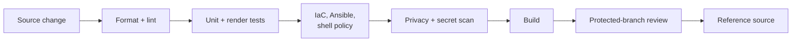

# Security model

## Claim vocabulary

This project distinguishes four kinds of statement:

- **Invariant:** a condition encoded in templates or infrastructure and checked
  by tests.
- **Default:** the shipped configuration, which an authorized operator can
  change.
- **Assumption:** a condition outside repository control.
- **Limitation:** a property the architecture intentionally does not provide.

The distinction prevents configuration defaults from being presented as
unconditional security guarantees.

## Enforced invariants

### Infrastructure interlock

The root OpenTofu module instantiates the egress-node module only when
`deployment_enabled` is true. The shipped value is false. Enabling it without
the required acknowledgement fails blocking module-input validation. Default
validation therefore models zero managed instances and does not need to inspect
a real account.

This is an accidental-deployment guard, not an authorization system. Anyone
who can change and execute the code can remove it.

### Ingress separation

In the converged desired state, TLS ingress and administrative ingress are
separate inputs. The TLS allowlist must be populated with valid,
non-world-open CIDRs. SSH is disabled by default; enabling it does not
implicitly reuse the TLS source list.

Network allowlists reduce exposure but do not authenticate an individual.
Lightsail creates base-OS instances with default world-open SSH and HTTP rules;
the separate public-ports resource replaces those rules only after creation.
The provider cannot make those calls atomic, so creation has a transient
exposure window. Environments that cannot tolerate it need a compute primitive
with creation-time network policy.

### Loopback service boundary

Xray accepts the tunneled inbound on loopback. Caddy is the public TLS boundary
and its reverse-proxy target is loopback. Unknown paths are rejected.
Structural tests inspect the rendered relationship, not merely the presence of
both services.

Loopback protects against direct remote access; it does not protect against a
compromised local process, root, or kernel.

### Destination deny policy

The server policy blocks loopback, private, carrier-grade NAT, link-local,
multicast, and analogous IPv6 destinations. DNS-aware routing is required so a
hostname cannot avoid IP policy merely by entering as a domain name. The same
protected set is applied again by the freedom outbound after its target
resolution. The template requires Xray `26.5.3` or newer for this final rule.

This is a maintained deny policy, not a complete content filter or a guarantee
against every DNS rebinding or provider-specific endpoint.

### Client fail-closed shape

The committed synthetic client example requires the tunnel outbound and
rejects a direct/freedom fallback. If its protected tunnel fails, that
configuration has no intended alternate egress path.

The repository cannot force every application to use that profile. System DNS,
IPv6, split routing, browser features, and operator-modified clients need
platform-specific tests before use.

### Configuration activation

Host configuration is rendered to a restricted staging location and validated
before it becomes active. Related service changes are handled as one logical
transaction, and activation behavior is designed to preserve or restore the
previous coherent configuration on a detected failure. A restored release must
pass the same loopback-listener and Caddy health checks as a new activation. If
recovery is not available or fails those checks, the role stops and disables the
managed service set, verifies that
the units are inactive and not boot-enabled, and removes the active pointer
only after that verification. A verification failure is reported as an
uncertain closure.

Ansible enforces its own default-off boolean and exact acknowledgement before
creating directories, rendering secrets, or changing services. This gate is
independent of the OpenTofu interlock.

No file transaction can guarantee recovery from disk loss, power failure,
kernel failure, or every package/service-manager failure. Single-node
availability remains an explicit limitation.

### Traffic-stop interlock

Budget decisions are side-effect-free until both policy and invocation permit
enforcement. Auto-stop requires an acknowledgement; the command requires an
enforcement flag; and the accepted unit set is fixed. Once armed, a stop
decision or a configuration/measurement error uses `disable --now` for Caddy,
Xray, and the guard timer so reboot or a later timer tick does not silently
restore egress. State writes are atomic and private.

Decision-only mode reports errors without changing services. Enforcement mode
trades availability for fail-closed behavior. Neither mode makes measurement
authoritative or turns it into a cost ceiling.

## Secret boundaries

The source tree defines where secrets are consumed, never the real values.

| Secret or sensitive artifact | Expected boundary | Must not enter |
| --- | --- | --- |
| AWS credentials | Operator-selected credential mechanism | repository, examples, CI logs |
| Tunnel identity | secret store to restricted server/client render | templates with a real value, issues, test fixtures |
| TLS private key | Caddy/host certificate mechanism | Git, generated artifacts, general-readable paths |
| SSH private key | operator workstation/agent | OpenTofu state, Ansible inventory, repository |
| OpenTofu state and plan | independently protected backend or local secure storage | Git, public CI artifact |
| Rendered client profile/QR | authorized recipient channel | repository, broad artifact retention |
| Traffic state/logs | restricted host paths | source tree, public issue attachments |

Synthetic fixtures use `example.com`, RFC 5737 addresses, reserved UUIDs, and
the fictional AWS account `123456789012`.

## Host privilege model

- Caddy and Xray run under dedicated service identities.
- Configuration and state paths use least-readable practical permissions.
- Controlled roots and executable paths must be absolute, normalized,
  non-overlapping, and within the documented hierarchy.
- systemd directives remove unneeded privilege, filesystem, device, and kernel
  surfaces while retaining network access required by each service.
- The guard may stop only the fixed Caddy, Xray, and guard-timer set when
  explicitly armed. Its Xray stats-query subprocess runs as the fixed `xray`
  user, and preflight rejects a non-regular, non-root-owned, or group/world
  writable Xray executable.
- Administration access is disabled by default at the cloud firewall.

Hardening directives are defense in depth. They do not establish a virtual
machine boundary between services.

## Validation layers

Each layer catches a different error class:

- linters catch syntax, style, and selected insecure constructs;
- unit tests check pure decisions and failure behavior;
- render tests inspect cross-template invariants;
- OpenTofu/Ansible checks validate declarative structure without deployment;
- privacy lint enforces repository-specific synthetic-data rules;
- Gitleaks detects common secret patterns in history;
- CodeQL analyzes supported source languages; and
- branch policy controls how passing changes reach `main`.

No layer proves that a live environment matches source. Drift and cloud
configuration need an independently authorized operational process.

## Security assumptions

The design assumes:

- source and pinned automation have been reviewed;
- an operator protects credentials and verifies provider/package provenance;
- DNS and certificate control belong to the authorized operator;
- the client trusts its operating system and certificate roots;
- clocks are sufficiently correct for TLS and monthly traffic bucketing;
- package repositories and runtime dependencies are not malicious;
- the destination is public and authorized; and
- host root and the AWS account are not already compromised.

If an assumption is false, the corresponding guarantee may not hold.

## Privacy properties

A fixed egress address makes traffic intentionally linkable to that address. TLS
protects the client-to-edge tunnel, but the egress node can observe connection
metadata and destinations may observe application traffic according to its own
encryption. AWS and network observers retain their normal visibility.

Accordingly, this design is for deterministic source identity—not anonymity,
anti-correlation, or traffic-obfuscation.
